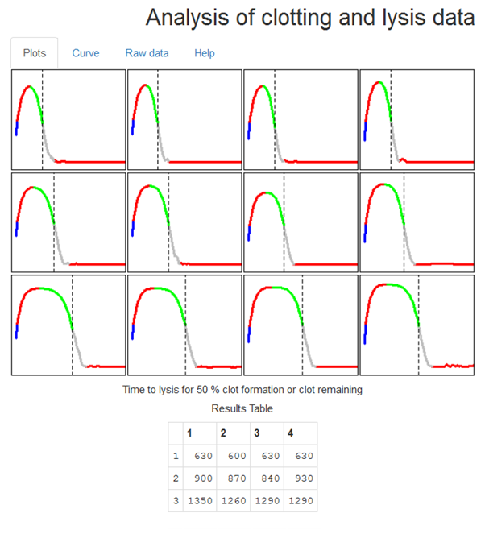

# Notes for analysing clotting and lysis curves

```{r, echo=FALSE}
knitr::opts_chunk$set(echo=FALSE)
```

A help tab in the app summarises the main features of ClotlysisCL version 0.9.  More details are presented below.

#The *Plots* tab

###Data Entry

A set of data is provided and is automatically read and analysed when the program starts.  The clotting and lysis curves generated can be explored to get a feel for using the various options discussed below.  However, the main use for the program is to facilitate analysis of user data.

Time course data, exported from a plate reader for example, should be formated as a single column of time in column 1 followed by columns of absorbance data.  The program detects the length and width of the data so there is no need to specify these dimensions.  Data can be read as csv or txt files, options which are specified using the check boxes in the left hand panel.  It is also necessary to specify if the columns have header text ("Time", well names "A1", "A2"... etc).  

__Note:__ *it is important not to leave empty cells, incomplete columns or rows, or spaces in names of column headers in any data files.  Gaps and spaces are the main reasons the program fails to read data or complete an analysis.*

Below is an example of a few rows of data to show how it should be formatted (and how it should appear in the *Raw data* tab).  


```{r}
#Data read from a text file with columns labelled Free and Bound (saved from your Excel spreadsheet for example)

Res<-read.csv("ClotLysisDoses.csv", header=TRUE)
Res1<-Res[1:20,] # The data file has 20 points but you can use fewer by reducing the 
library(pander)
pander(head(Res1)) #Shows what's in the data table, top few points
```

Note that the Time column is labelled *Time_s*, which is fine, but *Time s* would not work.

###Graphing the data

The graphical output in the main panel of the opening page is organised by number of rows specified, using the *How many rows* numerical input box.  Curves in the panels are modified by *% Clot formed or remaining* input and the sliders that control the *x and y axis ranges*. It should be noted that the axis options do not influence the way the data are analysed, only their graphical display.  The *% Clot formed or remaining* setting obviously affects the results of the analysis. 

The supplied data give an output as shown below for 50% clot formation or remaining (also corresponding to 50% clot lysis.  Similarly, 90% clot formation would correspond to 90% clot remaining or 10% clot lysis, etc).



###Baseline options

Below the axis range sliders there are input options as radio buttons that dictate how the baseline will be set.  The zero value selected will be the absorbance that equates to complete lysis.  The first option is for a global zero, which is specified by the adjacent numerical input.  In this case all curves will have the same zero absorbance value.  

A second option provided is to zero the curves at a starting absorbance value for each curve.  The default value for the *nth absorbance* is 1, i.e. the first absorbance reading of each curve.  Later points can be chosen by increasing the value in the *nth point* input box.  In this case individual curves may have different zero absorbance values but they will all be selected at the same time point. 

The 3rd option is to use the minimum absorbance value of each curve with the possibility to add an offset value using the slider below the radio buttons.  This is useful if there is drift and the point where 100% lysis is observed requires some manual adjustment. In this case the zero absorbance can vary for each curve and will likely come from a different time point along the curve.

Some care is needed when using these option as the chosen zero affects several of the calculated results.  The curves should be scrutinised to give authentic results for complete lysis and details of the chosen options recorded (the zeroed absorbance values can be selected for display in the **Results Table**).  The Results Table can display the absolute maximum absorbance or the absorbance above the baseline after subtraction of the chosen zero value. 

###Results table

The results table (also shown in the figure above), corresponds to the graphical layout and displays the results selected using the radio buttons in the left panel, summarised below.

* __Column names:__ Displays the header text in the data file in the specified arrangement
* __Max abs:__  Maximum absorbance achieved by each curve
* __Max abs - zero:__  Maximum absorbance above the baseline value
* __Time to max:__ Time at maximum absorbance
* __Time to clotting:__ Time to chosen % clotting 
* __Time to lysis:__ Time to chosen % clot remaining 
* __Time between clotting and lysis:__ Time between the 2 values above
* __Time to lysis from peak:__ Time from max absorbance to lysis
* __Time to full lysis:__ Time where absorbance reaches the chosen zero
* __AUC:__ Area under the curve (sum of all absorbance values to chosen zero)
* __Time at max rate increase:__ First derivative, time at maximum positive change
* __Time at max rate decrease:__ First derivative, time at maximum negative change
* __Chosen zero:__ The zero value for each curve as selected in zeroing options

It should be noted that the AUC value is approximated as a sum of absorbance readings and is most useful for comparing curves within the same data set.  Curves cannot be compared where data sets have different time intervals between readings.

The options that are calculated from the first derivative transformations are susceptible to noise and should be used with care.  First derivate plots are not shown on this tab but are available from the second tab, *Curve*.

Graphs and results table can be copied to the clipboard by highlighting and right-clicking using the mouse. If you download and run the ui.R and server.R files locally in RStudio, you can search for the line of code in the Results Table section of the server.R file that contains "clipboard" and remove the # from the beginning of the line.  If this line of code is active, the contents of the table are automatically placed in the clipboard and can be pasted directly elsewhere for further analysis.

#The *Curve* tab

The curve tab allows the user to focus on a single clot lysis curve, which is selected from the box in the upper right corner.  The plot includes lines for various analysis readouts, applying the selections for *% clot formation or remaining* and from *Zeroing Options* from the initial *Plots* tab.  The radio buttons under **Selected Results** specify what is shown in the table below the graph - all results, or results from clotting or lysis sections of the curve only.

The first derivative button adds a first derivative plot to the graph and shows a results table including the time where there is maximum rate of absorbance increase; maximum rate of absorbance decrease; and the first time when there is a plateau (no change between consecutive readings).  As mentioned above, these results are susceptible to noise in the absorbance data and should be checked by careful visual inspection alongside the curves.

There is also a checkbox in the left panel with an option to *Smooth data*, which replots the absorbance values using a moving average over 3 points along the length of each clot lysis curve.  The updated results are shown in the table below the curve, but not in the results table on the *Plots* tab, which uses only raw data. 

#The *Raw data* tab

On this tab the name of the data file loaded is shown alongside the raw data as a table for inspection.  It is possible to click through pages of data using boxes at the foot of the page and to show data from start to end or in reverse.

#The *Help* tab

The *Help* tab summarises these help notes and provides citation details.

R code, data and help files are available from:
https://github.com/drclongstaff/clotlysis09Repo

More information and links may be found at 
http://www.nibsc.org/science_and_research/biotherapeutics/haemostasis/fibrinolysis.aspx

